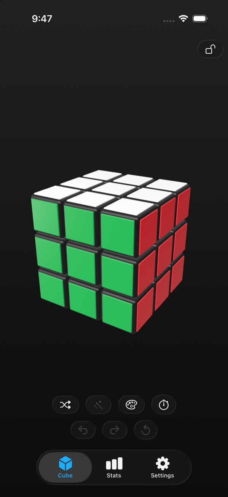

# Cube One

A Rubik's cube for iPhone, iPad, and Mac — play with a real-feeling 3D cube, scramble it, paint any position, and watch it get solved, either the fast way or the way humans learn.

<p align="center">
  
</p>

## Features

- **Play** — drag stickers to turn layers (middle slices included, with M/E/S notation), drag empty space or use two fingers to rotate the whole cube, pinch to zoom. Undo/redo, move history, sounds and haptics.
- **Scramble** — WCA-style random-state scrambles, animated; review, replay, or copy the scramble afterwards.
- **Solve** — two methods, selectable in Settings:
  - *Fast*: Kociemba two-phase algorithm, ~20-move solutions found in milliseconds.
  - *Beginner*: the classic layer-by-layer method in seven named stages (~150–250 moves), presented step by step so you can follow along and learn.
- **Customize** — paint any cube sticker by sticker with live legality checking that explains exactly why an impossible cube is impossible ("a corner is twisted", "two pieces are swapped", …). Custom color schemes with presets and a live preview.
- **Timer** — scramble, solve by hand, and the clock stops itself the moment the cube is solved. Personal bests and WCA-style averages in the Stats tab.
- **Native everywhere** — SwiftUI + RealityKit with the Liquid Glass design language, one codebase across iOS, iPadOS, and macOS 26+.

## Building

Requirements: Xcode 26+, iOS/macOS 26 SDKs.

```sh
open cubeone.xcodeproj            # scheme: cubeone — run on My Mac or any iPhone/iPad simulator
```

The cube engine is a standalone Swift package:

```sh
cd CubeKit
swift test                        # 53 tests; use -c release for performance checks
```

First launch generates the solver's lookup tables (~0.2 s in release builds) and caches them in Application Support.

## How it works

The project is split into a pure-logic package and a thin presentation layer:

- **CubeKit** — the cube model (cubie-level state, sticker validation), a Kociemba two-phase solver, a staged beginner solver, scrambling, and slice-move algebra. No UI imports; fully unit-tested.
- **cube/** (app) — RealityKit scene with per-cubelet entities and animated layer turns, gesture resolution (screen-space drag → the turn you meant), Liquid Glass UI, settings/stats persistence.

See [docs/ARCHITECTURE.md](docs/ARCHITECTURE.md) for the interesting parts: how solver coordinates and pruning tables work, how the beginner solver proves each stage correct, and the fixed-center trick that makes true middle-slice animation possible.

## Project history

The app was built in reviewed milestones; each pull request (#2–#15) documents the design decisions of its slice of the app, from the cube model and solvers through gestures, navigation, and polish.
